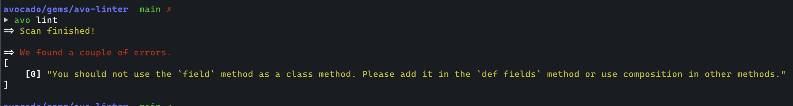

# Avo CLI

> [!WARNING]
> This is highly experimental.

This CLI is used by Avo, the Avo LSP (coming soon), and other products to do some common actions like linting the Avo configuration files.

It will show you errors that you might have missed in the Avo files along with improvements that you could make.



## Running it

```bash
gem install avo-cli
avo
```

## Overview

The linter uses different techniques to figure out if Avo configuration files are invalid or could be improved

#### Using Prism

The linter is using [prism](https://github.com/ruby/prism) to parse the files and create an AST for each one.
We the linter is run it will scan the files and return errors it found in the files.

It's doing that by scanning the AST for common patterns using user-defined rules similar to how rubocop is working.

### Installation

Run `bundle install` to install the dependencies.

```bash
bundle
```

### Testing

Rspec is used for tests. Run `bin/rspec` to run all tests.
